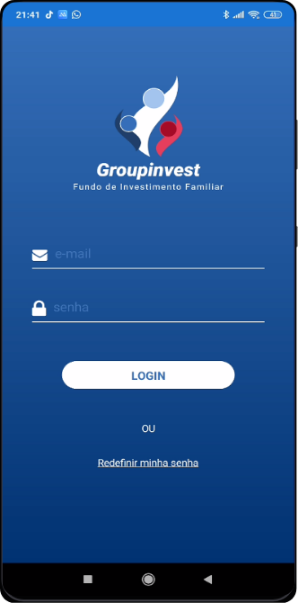
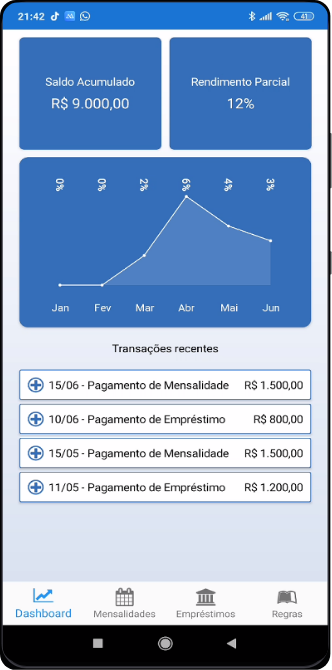
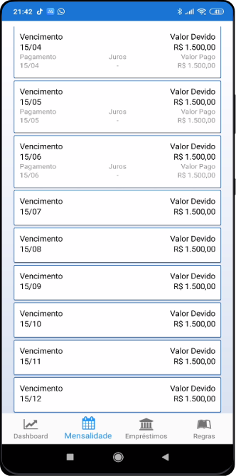
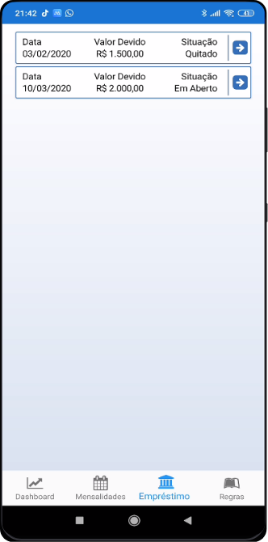
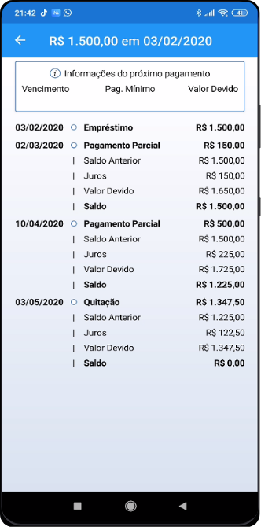
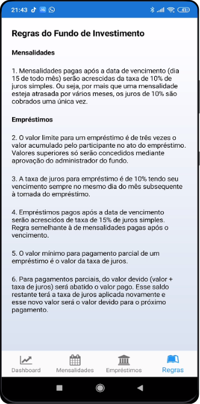

<h3 align="center">Groupinvest - Fundo de Reserva Privado</h3>

<!-- sumário -->

  
Conteúdo

  <ol>
    <li><a href="#sobre-o-projeto">Sobre o Projeto</a></li>
    <li><a href="#objetivo">Objetivo</a></li>
    <li><a href="#cenário">Cenário</a></li>
    <li>
      <a href="#definição-de-termos">Definição de Termos</a>
      <ul><li><a href="#período">Período</a></li></ul>
      <ul><li><a href="#participante">Participante</a></li></ul>
      <ul><li><a href="#mensalidade">Mensalidade</a></li></ul>
      <ul><li><a href="#empréstimo">Empréstimo</a></li></ul>
      <ul><li><a href="#redistribuição-de-cotas">Redistribuição de Cotas</a></li></ul>
    </li>
    <li><a href="#solução-proposta">Solução Proposta</a></li>
    <li>
      <a href="#funcionalidades-do-aplicativo">Funcionalidades do Aplicativo</a>
      <ul><li><a href="#splash-screen">Splash Screen</a></li></ul>
      <ul><li><a href="#login">Login</a></li></ul>
      <ul><li><a href="#dashboard">Dashboard</a></li></ul>
      <ul><li><a href="#mensalidades">Mensalidades</a></li></ul>
      <ul><li><a href="#empréstimos">Empréstimos</a></li></ul>
      <ul><li><a href="#detalhamento-do-empréstimo">Detalhamento do Empréstimo</a></li></ul>
      <ul><li><a href="#regras-do-fundo-de-reserva">Regras do Fundo de Reserva</a></li></ul>
    </li>
    <li><a href="#vídeo-de-apresentação">Vídeo de Apresentação</a></li>
  </ol>

## Sobre o projeto
Projeto desenvolvido utilizando o conceito de microsserviços com CQRS, Identity Server, mensageria (Azure Service Bus), bancos de dados MySQL e MongoDB, Event Sourcing e aplicativo construído em Xamarim.

## Objetivo
Desenvolver um aplicativo para os participantes de um fundo de reserva privado que permita o gerenciamento dos suas reservas e empréstimos. O aplicativo deve ser capaz de prover informações sobre os valores acumulados mensalmente, status destes pagamentos, extrato de empréstimos e qualquer informação que possa ajudar no gerenciamento das informações sobre a evolução dos valores acumulados.

## Cenário
A cada período, normalmente anual, um grupo de pessoas se une para criar um fundo que pretende, além de acumular dinheiro, fornecer uma linha de crédito de baixo custo para casos de emergência. Essa linha de crédito é financiada pelos valores acumulados pelos participantes dentro do período a taxas de juros pré-fixadas. Através desses juros se dá o rendimento do valor ao longo do período.

No início do período, cada participante que deseja entrar no fundo de investimento informa o número de cotas que deseja para o período. Cada cota possui um valor pré-determinado. Mensalmente, o participante deposita o valor total das cotas que assumiu na conta do administrador do fundo. Existe uma data limite para o depósito desse valor que é considerada como a data de vencimento da cota ou mensalidade. Em caso de depósito posterior à data de vencimento, o participante deverá efetuar o pagamento com juros pré-estabelecidos no momento de adesão ao período. Um ponto importante a ressaltar é que estes juros são juros simples. Por mais que o participante passe mais de um período em inadimplência, essa taxa é cobrada uma única vez sobre o atraso.

O fundo também tem o objetivo de fornecer crédito aos participantes com juros que dificilmente são encontrados no mercado. Existe um limite estabelecido com relação ao valor que pode ser disponibilizado. Esse limite é um fator multiplicador do valor total acumulado pelo participante até o momento dentro daquele período. Isso significa que o limite de crédito de um participante é o valor total acumulado até o momento multiplicado por esse fator. Esse limite pode ser considerado como uma aprovação automática (desde que haja recursos disponíveis em caixa), mas o administrador pode conceder um crédito de valor maior se desejar, baseando-se na análise de histórico de pagamentos (este compreendendo outros períodos, se for o caso), capacidade de quitação do participante ou qualquer outro meio disponível para a tomada de decisão.

Os empréstimos são similares às mensalidades com a diferença que possuem duas taxas de juros específicas. Uma para o empréstimo em situação normal que é a taxa base de juros e outra para empréstimo em atraso, quando a taxa base é substituída pela taxa em atraso (também juros simples).
Ao final do período, todo o valor acumulado pelos participantes (mensalidades e empréstimos) é distribuído entre todos respeitando as proporções de cotas de cada um deles. Sendo a soma de todas as cotas dos participantes 100% e a cota individual o percentual correspondente ao valor valor acumulado no período.

:top: <a href="#top">Voltar ao topo</a>

## Definição de Termos

### Período
Um período é uma vigência onde os valores são acumulados pelos participantes, sendo normalmente de 12 meses. O primeiro mês costuma ser utilizado para distribuição dos valores do período anterior e adesão dos participantes no novo período. Um período só pode ser aberto após o encerramento (contábil) do período anterior. O que significa que um período pode ser encerrado mas os valores ainda estarem sendo distribuídos, até por questões como limites bancários, entre outros.

### Participante
Um participante é uma pessoa que em algum momento participou do fundo de investimento. Ao final de cada período, com o encerramento, todos os participantes são inativados. Ao aderir ao novo período, o participante é reativado. Nessa adesão ele informa a quantidade de cotas desejadas. São necessários alguns dados básicos do participante como o nome, telefone e dados bancários para a distribuição de valores (nesse caso incluindo o CPF para operação entre bancos). Como o objetivo principal é ser um fundo cooperativo entre pessoas conhecidas, não são necessários tantos dados uma vez que o entendimento é que somente pessoas já conhecidas estejam participando.

### Mensalidade
Ao aderir a um período no fundo, o sistema deverá criar todas as mensalidades do participante para aquele período. O valor da mensalidade será o valor por cota multiplicado pelo total de cotas solicitadas pelo participante. Essa geração de todas as mensalidades é importante porque nesse momento será possível projetar futuramente o rendimento e fornecer informações para a tomada de decisões. Para mensalidades pagas após a data de vencimento, o sistema deverá cobrar os juros estabelecidos para mensalidades atrasadas.

### Empréstimo
Os empréstimos são concedidos com base no valor acumulado até o momento. Portanto, a cada pagamento de mensalidade ou empréstimo é importante sempre estar com o saldo atualizado do fundo de investimento para a concessão de novos empréstimos. O sistema deverá indicar se aquele empréstimo é aconselhado ou não baseando-se no valor acumulado pelo participante no ato da solicitação respeitando o fator de multiplicação e comparando-o com o valor solicitado. O administrador utilizará isso como mais uma fonte de informação para a tomada de decisão.

O vencimento de um empréstimo é sempre no mesmo dia do mês subsequente à tomada do valor. Ao contrair o empréstimo o participante compromete-se a pagar um percentual de juros já estabelecido para pagamento até a data de vencimento. Caso a data de pagamento seja posterior ao vencimento, a taxa base de juros é substituída pela taxa de empréstimo em atraso.

O pagamento mínimo de um empréstimo é o valor dos seus juros. Nesse caso, do valor total devido são subtraídos os juros para formar um novo valor base. A esse valor é acrescido a taxa base de juros de empréstimo e uma segunda parcela do empréstimo é gerada para o mês seguinte mantendo o dia de vencimento atual como base para o novo vencimento, ou seja, mesmo que um empréstimo seja pago com 10 dias após o vencimento, a data de vencimento da nova parcela será o dia de vencimento atual mas no mês subsequente.

Existe ainda a possibilidade de um empréstimo ser parcialmente pago, nesse caso subtrai-se do valor devido o total pago e o saldo é usado como valor base para a aplicação da taxa base de juros para a próxima parcela do empréstimo.

Importante ressaltar que os juros sempre são juros simples, ou seja, caso um participante não possa efetuar o pagamento do empréstimo em um mês, o valor base para o calculo da parcela seguinte será o valor base da parcela atual, sem considerar os juros. Neste caso, o valor devido no mês que passou fica sendo apenas os juros daquele período.

### Redistribuição de Cotas
Em algum momento um participante pode ter dificuldade em manter as suas cotas ou efetuar os pagamentos necessários. Quando isso ocorre, por solicitação do próprio participante ou do administrador do fundo, as cotas desse participante são redivididas. Isso significa que este participante abre mão da quantidade de cotas que solicitou inicialmente em nome de manter os pagamentos em dia. Sendo assim a redistribuição ocorre considerando o valor total acumulado pelo participante dentro do período dividido por doze meses. Esse seria o novo valor mensal do participante. Ao dividir esse valor pelo valor individual de cada cota, encontra-se a nova quantidade de cotas desse participante. Isso quita o compromisso dele com as mensalidades.

Caso o participante queira continuar com um número superior de cotas, o administrador pode conceder isso, aumentando essa quantidade. Então do total acumulado é feito o cálculo para entender quantos meses já foram quitados com o valor atual e o restante segue o fluxo normal de mensalidades.

Importante ressaltar que a redistribuição de cotas é referente unicamente às mensalidades, não tendo atuação sobre os empréstimos contraídos pelo participante. Caso haja atraso empréstimo em aberto, tudo se mantém com o fluxo normal de empréstimos.

:top: <a href="#top">Voltar ao topo</a>

## Solução Proposta
A solução proposta consiste no desenvolvimento de um aplicativo, onde os participantes ativos no período possam fazer o acompanhamento das informações referentes aos seus empréstimos, pagamentos, mensalidades e rendimentos previstos no período, além de uma aplicação onde os gestores do fundo realizarão todas as atividades administrativas, como cadastramento de participantes, adesões, concessões de empréstimos, encerramento e cálculo dos valores a serem distribuídos, dentre outras possibilidades.

:top: <a href="#top">Voltar ao topo</a>

## Funcionalidades do Aplicativo

### Splash Screen

Primeira tela ao abrir o aplicativo. Tem a responsabilidade de verificar se o participante já está autenticado e se o token gravado no aplicativo ainda é válido. O token tem validade de 24h e após esse período é necessária uma nova autenticação do participante.

:top: <a href="#top">Voltar ao topo</a>

### Login

Tela para autenticação dos participantes. Envia os dados para a API e, em caso de autenticação do participante, recebe o token e registra no aplicativo. Este token utiliza o padrão JWT e armazena informações sobre a identidade do participante para que nas futuras requisições os dados relacionados a este participante sejam entregues pela API.

:top: <a href="#top">Voltar ao topo</a>

### Dashboard

Tela principal do aplicativo. Fornece informações referentes ao investimento do participante. Valor total arrecadado, rendimento parcial considerando as movimentações de todos os participantes do fundo de investimento e últimas transações realizadas pelo participante.

:top: <a href="#top">Voltar ao topo</a>

### Mensalidades

Visão de todas as mensalidades do período. Informações sobre o pagamento incluindo valores de juros e valor total pago.

:top: <a href="#top">Voltar ao topo</a>

### Empréstimos

Visão de eventuais empréstimos contraídos pelo participante. Nesta tela é apresentada uma visão resumida sobre os empréstimos com a data do empréstimo, valor tomado e status de pagamento. Ao tocar em um empréstimo, uma visão detalhada será apresentada.

:top: <a href="#top">Voltar ao topo</a>

### Detalhamento do Empréstimo

Visão detalhada do empréstimo com o extrato de todas as movimentações e cálculos de eventuais parcelas futuras de um mesmo empréstimo. Isso permite que os participantes possam acompanhar em detalhes e sem dúvidas todo o histórico de pagamento daquele empréstimo.

:top: <a href="#top">Voltar ao topo</a>

### Regras do Fundo de Reserva

Visão que fornece as principais regras de funcionamento do fundo de reserva. É comum hoje que novos participantes precisem entrar em contato com os gestores do fundo para tirar dúvidas sobre o funcionamento do fundo. A cada período novos participantes costumam entrar para o fundo, portanto é interessante descrever as regras dessa forma.

:top: <a href="#top">Voltar ao topo</a>

## Vídeo de Apresentação
:clapper: [Demonstração no Youtube](https://youtu.be/3A5YSiEw6X0)

<a href="#top">:top: Voltar ao topo</a>

